<div align="center">

# VitaCheck — AI Health Risk Classifier

**Biomedical risk stratification using ensemble machine learning**

[](https://python.org)
[](https://streamlit.io)
[](https://scikit-learn.org)
[](https://huggingface.co/spaces/KarthikaKrishna123/vitacheck-ml)
[](https://github.com/KARTHIKAKRISHNA123/vitacheck-ml)
[](LICENSE)

> Classifies individuals as **Healthy** or **At Risk** based on 22 clinical and lifestyle features,  
> trained on 9,549 patient records with **99.30% recall** using a tuned Random Forest ensemble.

[Live Demo](https://huggingface.co/spaces/KarthikaKrishna123/vitacheck-ml) · [Report Issue](https://github.com/KARTHIKAKRISHNA123/vitacheck-ml/issues)

</div>

---

## Problem Statement

Biomedical research institutes recruit thousands of volunteers annually for clinical studies and longitudinal health analysis. Manually reviewing each participant's health profile to determine eligibility or risk level is time-consuming, inconsistent, and does not scale. Researchers lack a reliable automated system to stratify populations into healthy and at-risk groups based on multi-domain health indicators.

**VitaCheck** addresses this by providing a machine learning pipeline that ingests 22 physiological, lifestyle, and demographic features and produces a calibrated binary risk prediction — healthy (0) or at risk (1) — with a personalised explainability dashboard for each individual.

---

## Solution Overview

VitaCheck implements a complete supervised ML lifecycle:

- **EDA** — class balance analysis, correlation heatmaps, feature distribution plots, and boxplot comparisons across health outcomes
- **Preprocessing** — boolean normalization, stratified train-test split, StandardScaler fitting on training data only
- **Ensemble modeling** — five classifiers compared: Logistic Regression, KNN, Random Forest, Gradient Boosting, Voting Classifier
- **Threshold tuning** — decision threshold lowered from 0.50 to 0.25 to maximize recall (medical safety requirement)
- **Explainability** — global feature importance from Random Forest, personalized risk factor display per user
- **Deployment** — interactive Streamlit frontend deployed on Hugging Face Spaces

---

## Key Features

| Feature | Description |
|---|---|
| 22-feature health input | Sliders and dropdowns covering physical, lab, lifestyle, and demographic data |
| Tuned decision threshold | 0.25 threshold increases recall from 95.88% to 99.30% — catches 38 more at-risk individuals |
| Personalised risk chart | Red/green bar chart showing which of the user's specific values fall outside healthy ranges |
| Global feature importance | Ranked bar chart from Random Forest showing which features drive predictions |
| Complete health summary | Per-feature table with user value, healthy range, status, and importance score |
| Risk probability gauge | Visual progress bar showing raw at-risk probability score |
| Dark professional UI | Full dark theme with custom CSS — no Streamlit defaults |
| Model persistence | All artifacts saved: model, scaler, feature importance, threshold |

---

## Model Performance

| Model | Recall | Accuracy |
|---|---|---|
| Logistic Regression | 82.83% | 81.41% |
| KNN (k=5) | 88.35% | 88.32% |
| Gradient Boosting | 94.98% | 93.04% |
| Voting Classifier | 93.07% | 91.62% |
| **Random Forest** | **95.88%** | **93.77%** |
| **Random Forest (tuned, threshold=0.25)** | **99.30%** | **87.91%** |

> Recall is the primary metric. In medical risk classification, a false negative (missing an at-risk individual) is more dangerous than a false positive. The tuned model misses only 7 out of 996 at-risk individuals.

---

## Overall Architecture

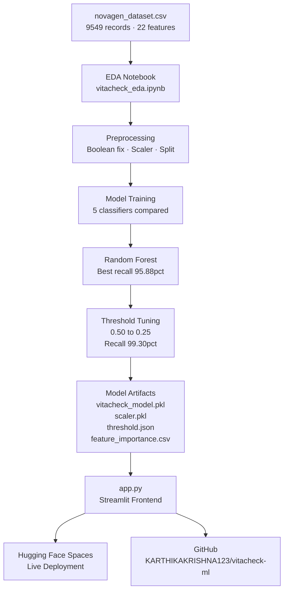

---

## System Architecture

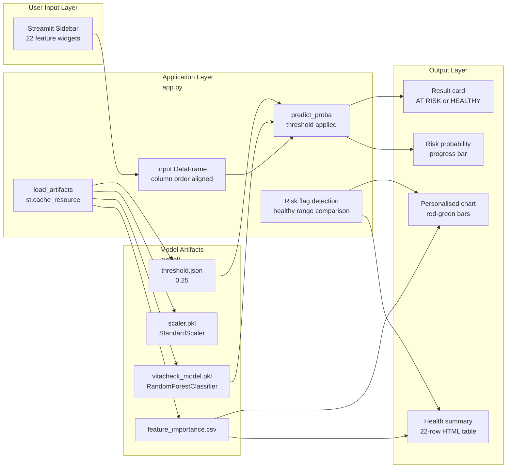

---

## Technology Stack — Complete Breakdown

| Technology | Version | Category | Purpose in Project | Why Chosen | Key Features Used |
|---|---|---|---|---|---|
| Python | 3.13 | Runtime | Core language for all ML and app logic | Industry standard for ML, vast ecosystem | f-strings, dataclasses, type hints, venv |
| pandas | 2.2.3 | Data Processing | DataFrame operations, CSV loading, feature manipulation | Best-in-class tabular data tool, integrates with scikit-learn | read_csv, DataFrame, drop, value_counts, isnull, describe |
| numpy | 2.1.3 | Numerical Computing | Array operations, threshold application, probability handling | Foundational ML dependency, C-speed array math | arange, astype, array slicing |
| scikit-learn | 1.6.1 | Machine Learning | All 5 classifiers, preprocessing, evaluation metrics | Complete ML lifecycle in one library, consistent API | RandomForestClassifier, KNeighborsClassifier, LogisticRegression, GradientBoostingClassifier, VotingClassifier, StandardScaler, train_test_split, accuracy_score, recall_score, classification_report, confusion_matrix |
| matplotlib | 3.10.0 | Visualization | All charts in notebook and Streamlit app | Fine-grained plot control, integrates with Streamlit pyplot | barh, subplots, patches, tight_layout, facecolor, spines |
| seaborn | — | Visualization | Correlation heatmap, boxplots in EDA | Statistical plot presets, heatmap API | heatmap, boxplot, set_palette |
| joblib | 1.4.2 | Model Persistence | Save and load trained model and scaler | scikit-learn native serialization, handles large numpy arrays efficiently | dump, load |
| streamlit | 1.45.1 | Web Framework | Complete interactive frontend | Python-native web apps with zero frontend code, slider/selectbox widgets | set_page_config, cache_resource, sidebar, columns, progress, pyplot, markdown, expander, dataframe |
| json | stdlib | Config | Save and load tuned decision threshold | Lightweight, human-readable config format | json.dump, json.load |
| matplotlib.patches | 3.10.0 | Chart Decoration | Legend patches for feature importance charts | Custom legend items not tied to plot data | mpatches.Patch with color and label |
| Git LFS | — | Version Control | Store large binary model files in GitHub and HF | HF Spaces rejects files over 10MB in regular git history | lfs migrate import, lfs track |

---

## ML Pipeline

```mermaid
flowchart TD
    subgraph Data["Data Ingestion"]
        CSV[novagen_dataset.csv] --> DF[pandas DataFrame\n9549 rows · 23 cols]
    end

    subgraph EDA["Exploratory Analysis"]
        DF --> NULL[Null check\nisnull().sum()]
        DF --> DIST[Feature distributions\nhistograms]
        DF --> CORR[Correlation matrix\nseaborn heatmap]
        DF --> BOX[Boxplots\nhealthy vs at-risk]
        DF --> CLASS[Class balance\nvalue_counts]
    end

    subgraph Preprocessing["Preprocessing"]
        DF --> BOOL[Boolean fix\nTrue-False strings to 0-1]
        BOOL --> XY[Feature-target split\nX = 22 cols, y = Target]
        XY --> SPLIT[Stratified split\n80pct train, 20pct test]
        SPLIT --> SCALE[StandardScaler\nfit on train only\ntransform both]
    end

    subgraph Training["Model Training"]
        SCALE --> LR[Logistic Regression\nL2 penalty, liblinear]
        SCALE --> KNN[KNN\nk=5, euclidean]
        SPLIT --> RF[Random Forest\n200 trees, no depth limit]
        SPLIT --> GB[Gradient Boosting\n150 trees, lr=0.1, depth=3]
        SCALE --> VC[Voting Classifier\nLR + KNN + RF, soft voting]
    end

    subgraph Selection["Model Selection"]
        RF --> BEST[Best: Random Forest\nRecall 95.88pct]
        BEST --> THRESH[Threshold tuning\ntest 0.10 to 0.90]
        THRESH --> TUNED[Optimal threshold 0.25\nRecall 99.30pct]
    end

    subgraph Artifacts["Saved Artifacts"]
        TUNED --> PKL[vitacheck_model.pkl]
        SCALE --> SPKL[scaler.pkl]
        RF --> FIMP[feature_importance.csv]
        TUNED --> TJSON[threshold.json]
    end
```

---

## Request Lifecycle

### Request 1: User Loads the App (Landing Page)

```
1. BROWSER REQUEST
   └── User opens https://huggingface.co/spaces/KarthikaKrishna123/vitacheck-ml
       → HF Spaces serves the Streamlit container

2. APP INITIALIZATION
   └── app.py executes top-level code
       → st.set_page_config() sets title, icon, layout
       → CSS injected via st.markdown(unsafe_allow_html=True)

3. ARTIFACT LOADING
   └── load_artifacts() called (decorated with @st.cache_resource)
       → joblib.load("model/vitacheck_model.pkl") → RandomForestClassifier object
       → joblib.load("model/scaler.pkl") → StandardScaler object
       → pd.read_csv("model/feature_importance.csv") → 22-row DataFrame
       → json.load("model/threshold.json") → {"threshold": 0.25}
       → All four objects returned and cached in memory
       → Subsequent user interactions reuse cached objects — no re-loading

4. SIDEBAR RENDERING
   └── 22 widget definitions execute:
       → st.sidebar.slider() for 10 numerical features
       → st.sidebar.selectbox() for 9 categorical features
       → Diet one-hot derived: diet_vegan, diet_vegetarian
       → Blood group one-hot derived: blood_ab, blood_b, blood_o
       → predict_btn = st.sidebar.button() renders primary button

5. MAIN PAGE RENDERING (predict_btn is False)
   └── 4 metric cards rendered via HTML div injection
       → st.info() renders instructions banner
       → matplotlib figure created: 22-bar horizontal chart
       → Colors assigned: red (top 3), blue (top 4-8), grey (rest)
       → st.pyplot(fig) renders chart inline
       → plt.close() releases figure memory
```

### Request 2: User Submits Health Data (Prediction)

```
1. USER ACTION
   └── User adjusts sliders/dropdowns → clicks "Run Health Risk Assessment"
       → predict_btn = True
       → Streamlit reruns app.py from top

2. INPUT CONSTRUCTION
   └── input_data dict built with exact column order matching training data
       → 23 keys including placeholder "Target": 0
       → pd.DataFrame([input_data]) creates 1-row DataFrame
       → .drop("Target", axis=1) removes placeholder → 22 features

3. INFERENCE
   └── model.predict_proba(input_df)
       → Returns [[P(healthy), P(at-risk)]]
       → proba = result[0][1] — at-risk probability (float 0.0–1.0)
       → prediction = int(proba >= THRESHOLD)
       → THRESHOLD = 0.25 (loaded from threshold.json)

4. RISK ANALYSIS
   └── Loop over user_values dict (22 key-value pairs)
       → Each value compared against HEALTHY_RANGES dict
       → value < low OR value > high → risk_flags list
       → else → healthy_flags list
       → risky_features = [feature names from risk_flags]

5. OUTPUT RENDERING
   └── Result card: HTML div with conditional class (vc-result-risk or vc-result-healthy)
       → st.progress(float(proba)) renders probability gauge
       → Risk factor list: HTML divs with red left border per flagged feature
       → Personalised chart: bar colors assigned per feature (red if in risky_features)
       → Summary table: 22 HTML rows with explicit color classes — no pandas Styler
       → Footer rendered via st.markdown
```

---

## Data Flow

```
CSV File
  │
  ▼
pandas DataFrame (9549 × 23)
  │
  ├── EDA path ──────────────────────────────────────────────────────────────
  │   Boolean columns detected as object dtype
  │   .map({"True":1,"False":0}) converts to int
  │   .isnull().sum() — null audit
  │   .corr() — Pearson correlation matrix → seaborn heatmap
  │   .hist() per column → distribution plots
  │   .boxplot(by="Target") → class-split boxplots
  │
  ├── Preprocessing path ─────────────────────────────────────────────────────
  │   X = df.drop("Target", axis=1) → shape (9549, 22)
  │   y = df["Target"] → shape (9549,)
  │   train_test_split(stratify=y) → X_train(7639×22), X_test(1910×22)
  │   StandardScaler.fit_transform(X_train) → X_train_scaled
  │   StandardScaler.transform(X_test) → X_test_scaled
  │   (scaler mean/std learned from train only — prevents data leakage)
  │
  ├── Training path ──────────────────────────────────────────────────────────
  │   Tree models (RF, GB) trained on X_train (unscaled — trees are scale-invariant)
  │   Distance models (LR, KNN) trained on X_train_scaled
  │   Each model: .fit() → internal weight/tree optimization
  │   Each model: .predict(X_test) → binary labels
  │   recall_score, accuracy_score, classification_report computed
  │
  ├── Threshold tuning path ──────────────────────────────────────────────────
  │   rf.predict_proba(X_test)[:,1] → probability array (1910,)
  │   np.arange(0.1, 0.9, 0.05) → 16 threshold candidates
  │   For each threshold: (proba >= thresh).astype(int) → binary predictions
  │   recall_score, precision_score, f1_score computed per threshold
  │   Best threshold selected: max recall with precision >= 0.80
  │   → threshold = 0.25 saved to threshold.json
  │
  └── Artifact path ──────────────────────────────────────────────────────────
      joblib.dump(rf, "model/vitacheck_model.pkl") — 27MB binary
      joblib.dump(scaler, "model/scaler.pkl")
      importance_df.to_csv("model/feature_importance.csv")
      json.dump({"threshold": 0.25}, "model/threshold.json")

Streamlit App Runtime
  │
  User input (22 values via widgets)
      │
      ▼
  pd.DataFrame([input_data]) — 1×22
      │
      ▼
  model.predict_proba() — returns [[P0, P1]]
      │
      ├── P1 >= 0.25 → prediction = 1 (AT RISK)
      └── P1 < 0.25  → prediction = 0 (HEALTHY)
          │
          ▼
      Risk flag loop — 22 comparisons against HEALTHY_RANGES
          │
          ▼
      Personalised chart + summary table rendered
```

---

## UML Diagrams

<details>
<summary>View all 9 UML diagrams</summary>

### 1. Use Case Diagram

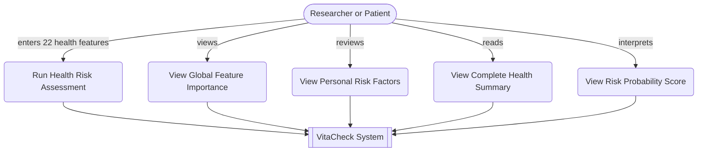

### 2. Class Diagram

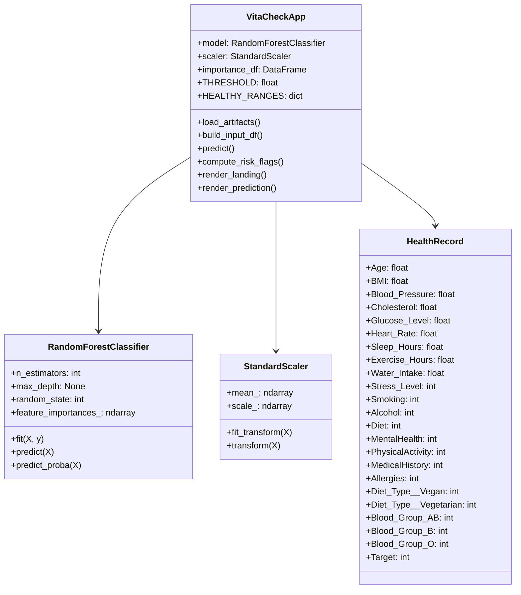

### 3. Sequence Diagram — Prediction Flow

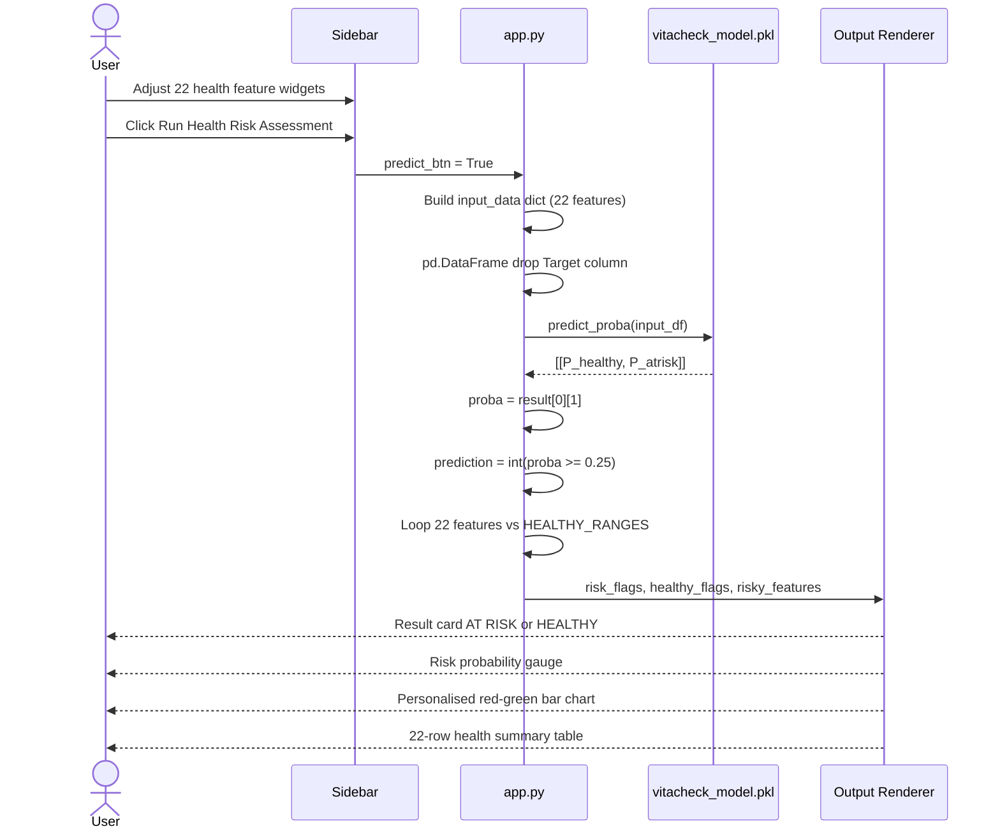

### 4. Activity Diagram — ML Training Pipeline

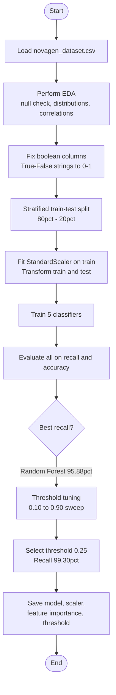

### 5. State Diagram — App States

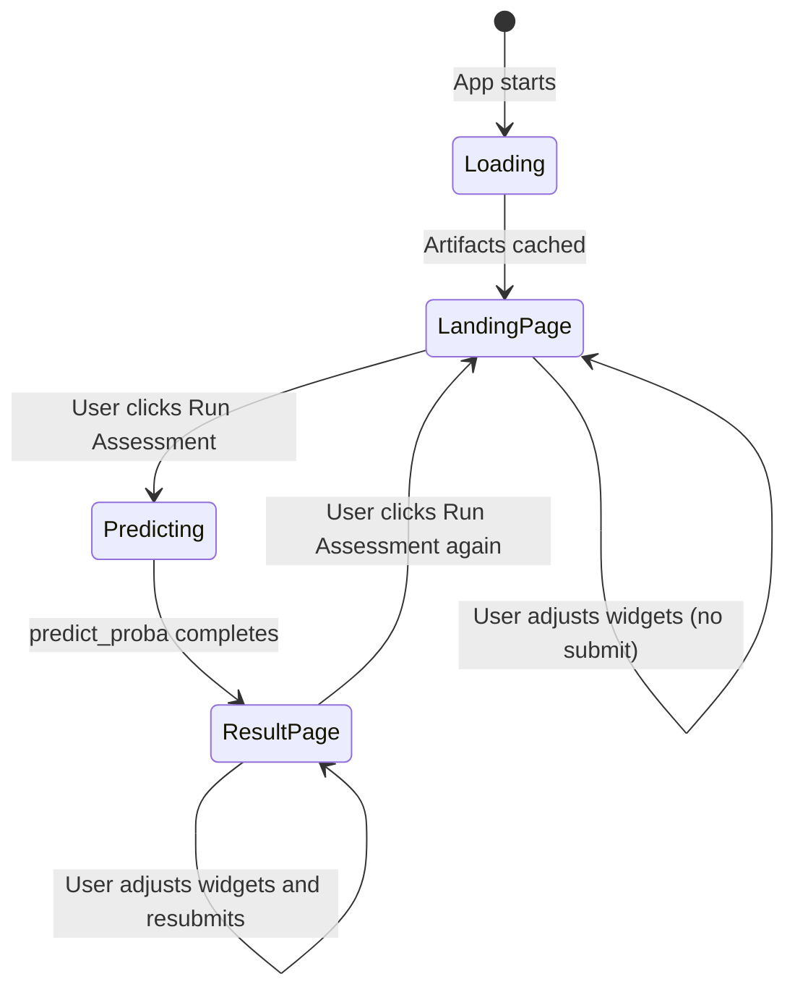

### 6. Component Diagram

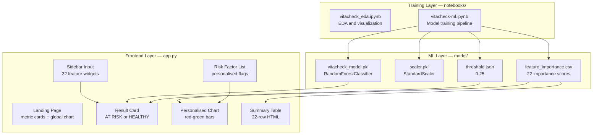

### 7. Deployment Diagram

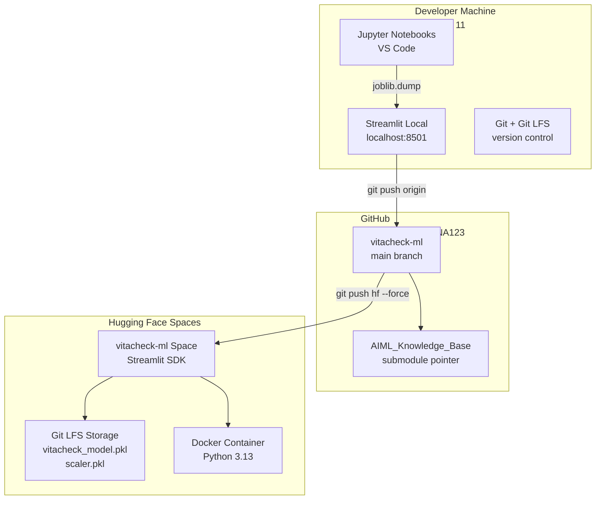

### 8. Package Diagram

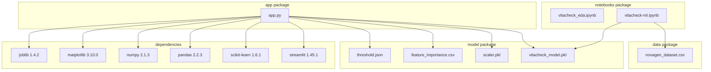

### 9. Object Diagram — Runtime State

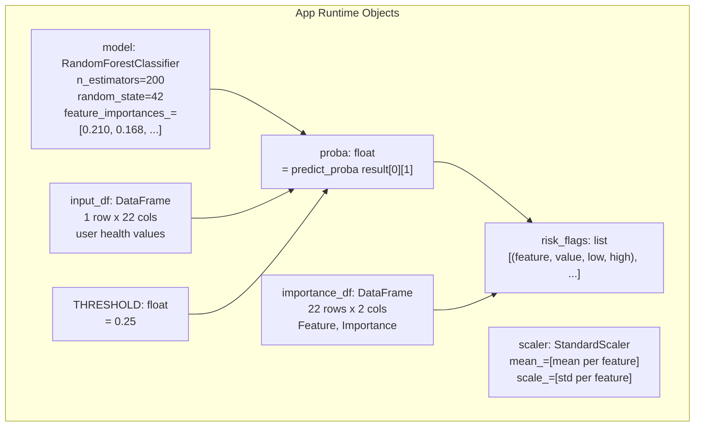

</details>

---

## Data Flow Diagrams

<details>
<summary>View DFD Level 0 and Level 1</summary>

### DFD Level 0 — Context Diagram

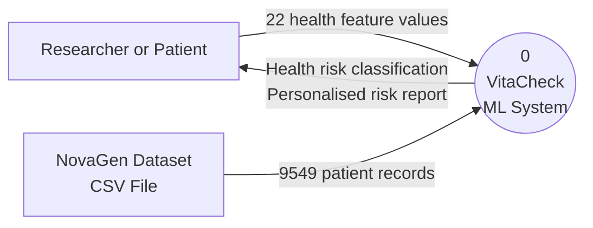

### DFD Level 1 — System Decomposition

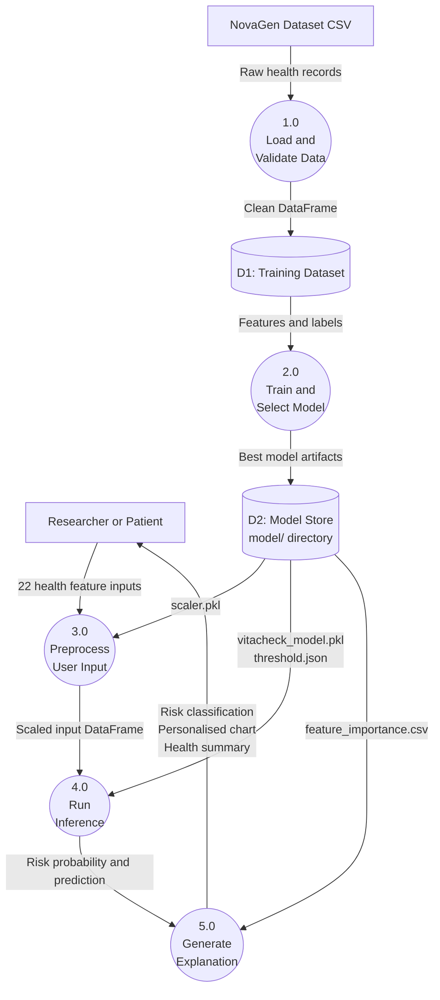

</details>

---

## Folder Structure

```
vitacheck-ml/
│
├── app.py                          ← Streamlit entry point — full dark UI
│
├── requirements.txt                ← HF Spaces dependency manifest
│
├── .gitattributes                  ← Git LFS tracking rules for .pkl, .png, .csv
│
├── model/                          ← Saved ML artifacts (Git LFS tracked)
│   ├── vitacheck_model.pkl         ← Trained RandomForestClassifier (200 trees)
│   ├── scaler.pkl                  ← Fitted StandardScaler (train statistics only)
│   ├── feature_importance.csv      ← 22 features ranked by importance score
│   └── threshold.json              ← Tuned decision threshold: {"threshold": 0.25}
│
├── notebooks/                      ← Jupyter analysis and training notebooks
│   ├── vitacheck_eda.ipynb         ← EDA: null checks, heatmap, distributions, boxplots
│   ├── vitacheck-ml.ipynb          ← Full ML pipeline: preprocessing → training → saving
│   ├── class_distribution.png      ← Target class balance chart
│   ├── correlation_heatmap.png     ← Pearson correlation matrix
│   ├── feature_distributions.png  ← 10-panel histogram grid
│   ├── boxplots_by_target.png      ← Feature distributions split by health outcome
│   ├── feature_importances.png     ← Ranked horizontal bar chart
│   ├── threshold_tuning.png        ← Recall vs precision vs F1 across thresholds
│   └── confusion_matrix.png        ← Final confusion matrix at threshold 0.25
│
└── data/
    └── novagen_dataset.csv         ← Source dataset: 9549 records, 23 columns
```

---

## Prerequisites

- Python 3.10 or above
- Git with Git LFS installed (`git lfs install`)
- pip or uv package manager

---

## Installation

```bash
# Clone the repository
git clone https://github.com/KARTHIKAKRISHNA123/vitacheck-ml.git
cd vitacheck-ml

# Pull LFS files (model artifacts)
git lfs pull

# Create virtual environment
python -m venv .venv
source .venv/Scripts/activate      # Windows Git Bash
# source .venv/bin/activate         # macOS/Linux

# Install dependencies
pip install -r requirements.txt

# Run the app
streamlit run app.py
```

App opens at `http://localhost:8501`

---

## Environment Variables

No environment variables required. All configuration is loaded from the `model/` directory at runtime. The Streamlit app reads:

| File | Key | Value | Purpose |
|---|---|---|---|
| `model/threshold.json` | `threshold` | `0.25` | Decision boundary for at-risk classification |
| `model/vitacheck_model.pkl` | — | Serialized RF object | Inference |
| `model/scaler.pkl` | — | Serialized scaler object | Not used for RF (scale-invariant) |
| `model/feature_importance.csv` | `Feature`, `Importance` | 22 rows | Chart and table rendering |

---

## Feature Reference

| Feature | Type | Range | Description |
|---|---|---|---|
| Age | Continuous | 1–100 | Age in years |
| BMI | Continuous | 10.0–50.0 | Body Mass Index |
| Blood_Pressure | Continuous | 60–200 | Systolic blood pressure (mmHg) |
| Cholesterol | Continuous | 100–400 | Cholesterol level (mg/dL) |
| Glucose_Level | Continuous | 50–300 | Blood glucose (mg/dL) |
| Heart_Rate | Continuous | 40–180 | Resting heart rate (bpm) |
| Sleep_Hours | Continuous | 0–12 | Average sleep hours per day |
| Exercise_Hours | Continuous | 0–5 | Exercise hours per day |
| Water_Intake | Continuous | 0–8 | Daily water intake (litres) |
| Stress_Level | Ordinal | 1–10 | Self-reported stress score |
| Smoking | Ordinal | 0–2 | 0=Non-smoker, 1=Smoker, 2=Ex-smoker |
| Alcohol | Ordinal | 0–2 | 0=None, 1=Occasional, 2=Regular |
| Diet | Ordinal | 0–2 | 0=Standard, 1=Vegetarian, 2=Vegan |
| MentalHealth | Ordinal | 0–2 | 0=Good, 1=Moderate, 2=Poor |
| PhysicalActivity | Ordinal | 0–3 | 0=Sedentary, 1=Light, 2=Moderate, 3=Active |
| MedicalHistory | Ordinal | 0–2 | 0=None, 1=Minor, 2=Major |
| Allergies | Binary | 0–1 | Presence of known allergies |
| Diet_Type__Vegan | Binary | 0–1 | One-hot encoded from Diet |
| Diet_Type__Vegetarian | Binary | 0–1 | One-hot encoded from Diet |
| Blood_Group_AB | Binary | 0–1 | One-hot encoded blood type |
| Blood_Group_B | Binary | 0–1 | One-hot encoded blood type |
| Blood_Group_O | Binary | 0–1 | One-hot encoded blood type |

---

## Deployment Guide

### Local

```bash
streamlit run app.py
```

### Hugging Face Spaces

```bash
# Add HF remote
git remote add hf https://huggingface.co/spaces/KarthikaKrishna123/vitacheck-ml

# Push (requires HF Write access token as password)
git push hf main --force
```

Space auto-builds on push. Build time: 2–3 minutes. Monitor at:
`https://huggingface.co/spaces/KarthikaKrishna123/vitacheck-ml`

---

## Engineering Decisions and Tradeoffs

| Decision | Choice | Alternative | Rationale |
|---|---|---|---|
| Primary metric | Recall | Accuracy | Missing an at-risk person (FN) is medically more dangerous than a false alarm |
| Decision threshold | 0.25 | 0.50 (default) | Increases recall from 95.88% to 99.30% at acceptable precision cost |
| Best model | Random Forest | Gradient Boosting | Higher recall (95.88% vs 94.98%), no feature scaling needed, faster inference |
| Feature scaling | Applied only to LR and KNN | Applied universally | Tree-based models are scale-invariant; scaling RF adds no value |
| Table rendering | Pure HTML divs | pandas Styler | Streamlit dark theme makes Styler background colors invisible — HTML gives explicit color control |
| Model serialization | joblib | pickle | joblib handles large numpy arrays more efficiently |
| Large file storage | Git LFS | Regular git | HF Spaces rejects files over 10MB in regular git history |

---

## Troubleshooting

| Error | Cause | Fix |
|---|---|---|
| `FileNotFoundError: model/vitacheck_model.pkl` | Running from wrong directory or LFS not pulled | Run `git lfs pull` then `streamlit run app.py` from project root |
| `FileNotFoundError: data/novagen_dataset.csv` in notebook | Notebook is in `notebooks/` subdirectory | Use `../data/novagen_dataset.csv` as the path |
| HF push rejected: files larger than 10MB | Model file committed without LFS | Run `git lfs migrate import --include="*.pkl" --everything` then force push |
| HF push rejected: binary files | PNG files not tracked by LFS | Run `git lfs migrate import --include="*.png" --everything` then force push |
| `KeyError: 'RdY1Gn' is not a known colormap` | Typo — `1` instead of lowercase `l` in `RdYlGn` | Change to `cmap="RdYlGn"` |

---

## Future Roadmap

- SHAP values for per-prediction feature attribution (not just healthy range comparison)
- SMOTE or class-weight tuning if dataset becomes imbalanced
- XGBoost and LightGBM comparison
- FastAPI backend to decouple inference from Streamlit
- CSV batch prediction — upload a file, get predictions for all rows
- User authentication for session persistence on HF Spaces

---

## License

MIT License — see [LICENSE](LICENSE) for details.

---

## Credits

- Dataset: NovaGen Research Labs observational health study (9,549 records)
- Built as part of Anna University CSE supervised ML curriculum (Assignment 5)
- Developed by **Karthika Krishna M** — [GitHub](https://github.com/KARTHIKAKRISHNA123)

---

<div align="center">

**VitaCheck** · Random Forest + Streamlit · For research purposes only · Not a substitute for clinical diagnosis

</div>