<div align="center">

# VitaCheck — AI Health Risk Classifier

**Biomedical risk stratification using ensemble machine learning**

[](https://python.org)
[](https://streamlit.io)
[](https://scikit-learn.org)
[](https://huggingface.co/spaces/KarthikaKrishna123/vitacheck-ml)
[](https://github.com/KARTHIKAKRISHNA123/vitacheck-ml)
[](LICENSE)

> Classifies individuals as **Healthy** or **At Risk** based on 22 clinical and lifestyle features,
> trained on 9,549 patient records with **99.30% recall** using a tuned Random Forest ensemble.

[Live Demo](https://huggingface.co/spaces/KarthikaKrishna123/vitacheck-ml) · [Report Issue](https://github.com/KARTHIKAKRISHNA123/vitacheck-ml/issues)

</div>

---

## Problem Statement

Biomedical research institutes recruit thousands of volunteers annually for clinical studies and longitudinal health analysis. Manually reviewing each participant's health profile to determine eligibility or risk level is time-consuming, inconsistent, and does not scale. Researchers lack a reliable automated system to stratify populations into healthy and at-risk groups based on multi-domain health indicators.

**VitaCheck** addresses this by providing a machine learning pipeline that ingests 22 physiological, lifestyle, and demographic features and produces a calibrated binary risk prediction — healthy (0) or at risk (1) — with a personalised explainability dashboard for each individual.

---

## Solution Overview

VitaCheck implements a complete supervised ML lifecycle:

- **EDA** — class balance analysis, correlation heatmaps, feature distribution plots, and boxplot comparisons across health outcomes
- **Preprocessing** — boolean normalization, stratified train-test split, StandardScaler fitting on training data only
- **Ensemble modeling** — five classifiers compared: Logistic Regression, KNN, Random Forest, Gradient Boosting, Voting Classifier
- **Threshold tuning** — decision threshold lowered from 0.50 to 0.25 to maximize recall
- **Explainability** — global feature importance from Random Forest, personalized risk factor display per user
- **Deployment** — interactive Streamlit frontend deployed on Hugging Face Spaces

---

## Key Features

| Feature | Description |
|---|---|
| 22-feature health input | Sliders and dropdowns covering physical, lab, lifestyle, and demographic data |
| Tuned decision threshold | 0.25 threshold increases recall from 95.88% to 99.30% |
| Personalised risk chart | Red/green bar chart showing which of the user's values fall outside healthy ranges |
| Global feature importance | Ranked bar chart from Random Forest |
| Complete health summary | Per-feature table with value, healthy range, status, and importance score |
| Risk probability gauge | Visual progress bar showing raw at-risk probability |
| Dark professional UI | Full dark theme with custom CSS |
| Model persistence | All artifacts saved: model, scaler, feature importance, threshold |

---

## Model Performance

| Model | Recall | Accuracy |
|---|---|---|
| Logistic Regression | 82.83% | 81.41% |
| KNN (k=5) | 88.35% | 88.32% |
| Gradient Boosting | 94.98% | 93.04% |
| Voting Classifier | 93.07% | 91.62% |
| **Random Forest** | **95.88%** | **93.77%** |
| **Random Forest (tuned, threshold=0.25)** | **99.30%** | **87.91%** |

> Recall is the primary metric. In medical risk classification, a false negative is more dangerous than a false positive. The tuned model misses only 7 out of 996 at-risk individuals.

---

## Overall Architecture

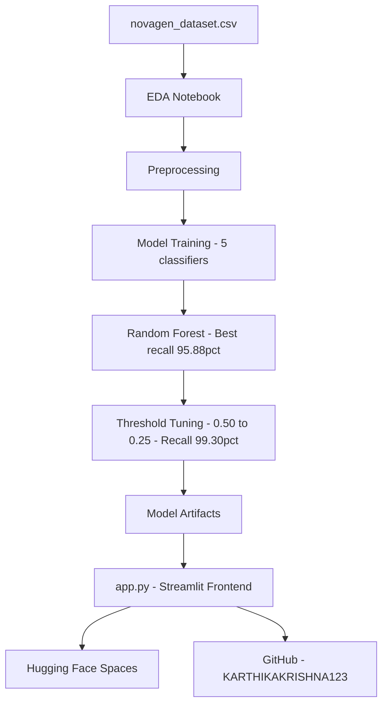

---

## System Architecture

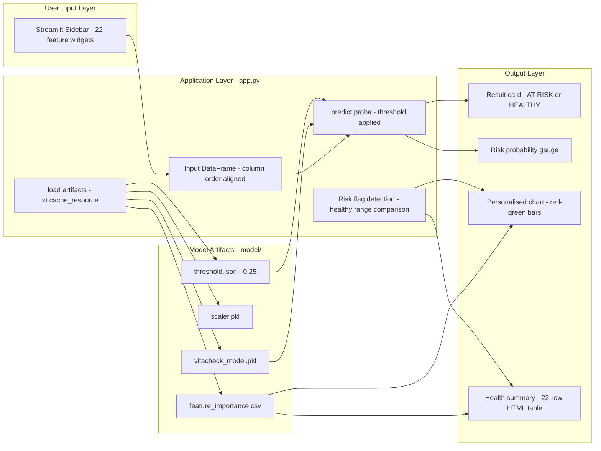

---

## Technology Stack

| Technology | Version | Category | Purpose | Why Chosen | Key Features Used |
|---|---|---|---|---|---|
| Python | 3.13 | Runtime | Core language | Industry standard for ML | f-strings, venv, type hints |
| pandas | 2.2.3 | Data Processing | DataFrame operations, CSV loading | Best-in-class tabular data tool | read_csv, DataFrame, drop, isnull, describe |
| numpy | 2.1.3 | Numerical Computing | Array operations, threshold application | Foundational ML dependency | arange, astype, array slicing |
| scikit-learn | 1.6.1 | Machine Learning | All 5 classifiers, preprocessing, metrics | Complete ML lifecycle in one library | RandomForestClassifier, KNeighborsClassifier, LogisticRegression, GradientBoostingClassifier, VotingClassifier, StandardScaler, train_test_split, recall_score |
| matplotlib | 3.10.0 | Visualization | All charts in notebook and app | Fine-grained plot control | barh, subplots, patches, tight_layout, facecolor |
| seaborn | — | Visualization | Correlation heatmap, boxplots in EDA | Statistical plot presets | heatmap, boxplot, set_palette |
| joblib | 1.4.2 | Model Persistence | Save and load trained model and scaler | scikit-learn native serialization | dump, load |
| streamlit | 1.45.1 | Web Framework | Complete interactive frontend | Python-native web apps | set_page_config, cache_resource, sidebar, columns, progress, pyplot |
| json | stdlib | Config | Save and load tuned decision threshold | Lightweight human-readable config | json.dump, json.load |
| Git LFS | — | Version Control | Store large binary model files | HF Spaces rejects files over 10MB | lfs migrate import, lfs track |

---

## ML Pipeline

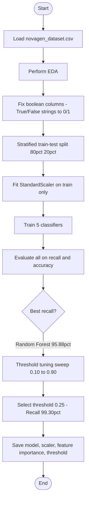

---

## Request Lifecycle

### Landing Page Load

```
1. Browser opens HF Space URL
2. app.py executes — st.set_page_config, CSS injected
3. load_artifacts() — joblib loads model.pkl, scaler.pkl
   pd.read_csv loads feature_importance.csv
   json.load reads threshold.json (0.25)
   All cached via @st.cache_resource
4. 22 sidebar widgets rendered inside st.form
5. Global feature importance chart rendered as base64 inline image
```

### Prediction Submission

```
1. User fills inputs, clicks Run Health Risk Assessment (form submit)
2. ONE Python rerun triggered — the only rerun in the session
3. input_data dict built — 22 features in exact training column order
4. model.predict_proba(input_df)[0][1] returns at-risk probability
5. prediction = int(proba >= 0.25) applies tuned threshold
6. Loop over 22 features vs HEALTHY_RANGES — builds risk_flags list
7. All HTML pre-computed and stored in st.session_state.result_cache
8. Result card, probability bar, personalised chart, summary table rendered
9. All post-result interactions handled in browser — zero further reruns
```

---

## Data Flow

```
novagen_dataset.csv
  → pandas DataFrame (9549 x 23)
  → Boolean fix (True/False strings to 0/1)
  → X = drop Target (9549 x 22), y = Target (9549,)
  → Stratified split: X_train (7639 x 22), X_test (1910 x 22)
  → StandardScaler.fit_transform(X_train) — learns mean and std
  → StandardScaler.transform(X_test) — applies same stats (no leakage)
  → 5 models trained and evaluated
  → Random Forest selected (best recall)
  → Threshold sweep: predict_proba compared at 16 thresholds
  → Best threshold 0.25 saved to threshold.json

Streamlit Runtime
  → User input (22 values via st.form) → pd.DataFrame (1 x 22)
  → model.predict_proba() → at-risk probability
  → probability >= 0.25 → AT RISK or HEALTHY
  → 22 values compared against HEALTHY_RANGES
  → All HTML pre-built → stored in result_cache
  → Personalised chart encoded as base64 → zero layout shift
```

---

## UML Diagrams

<details>
<summary>View all 9 UML diagrams</summary>

### 1. Use Case Diagram


### 2. Class Diagram

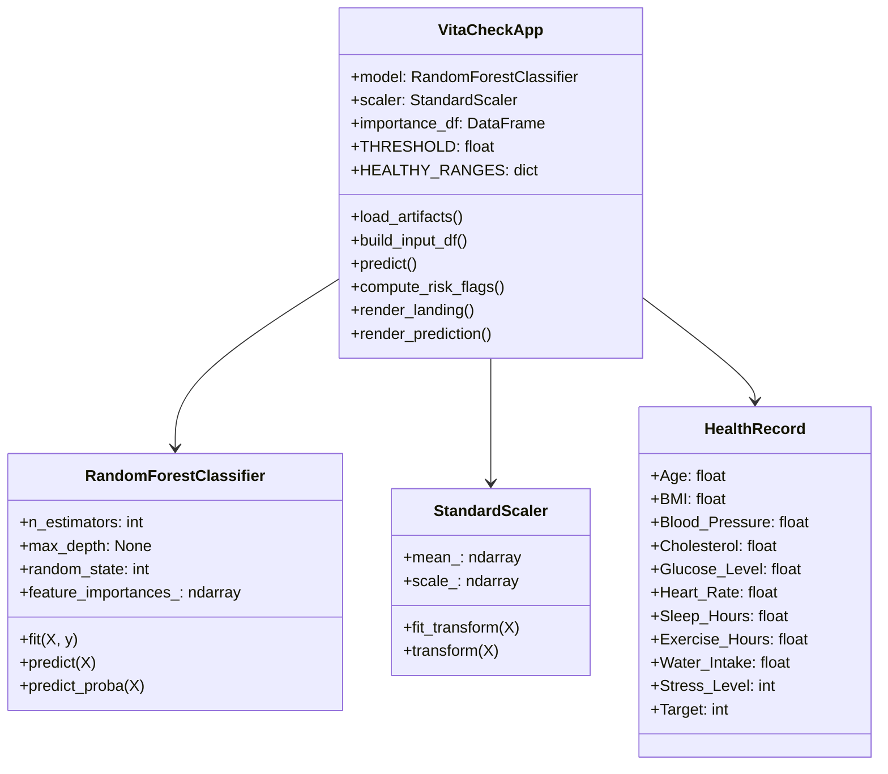

### 3. Sequence Diagram

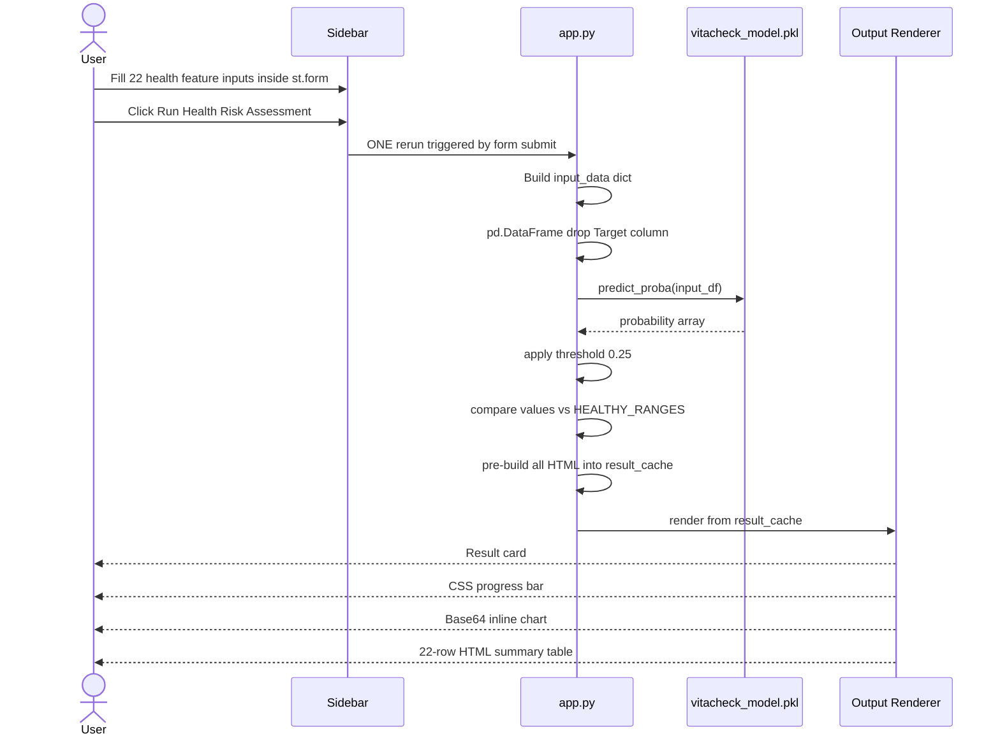

### 4. Activity Diagram

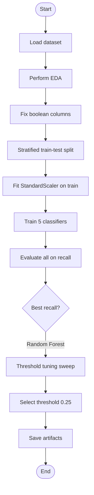

### 5. State Diagram

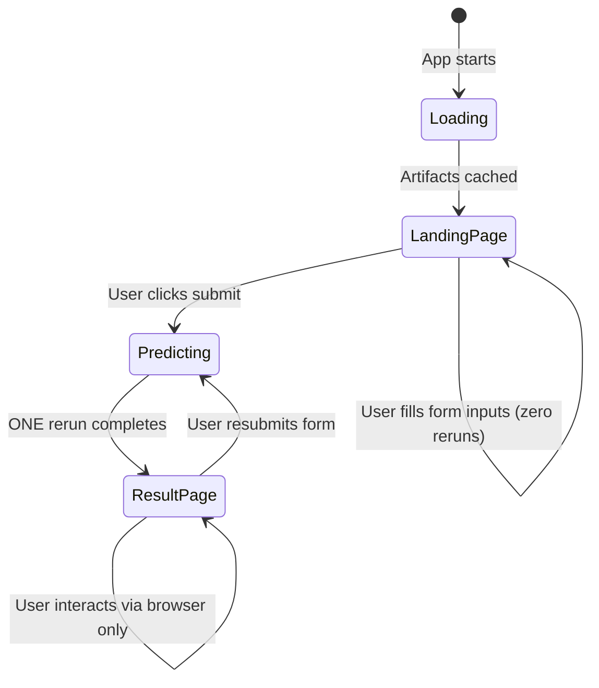

### 6. Component Diagram

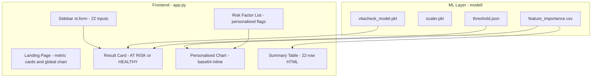

### 7. Deployment Diagram

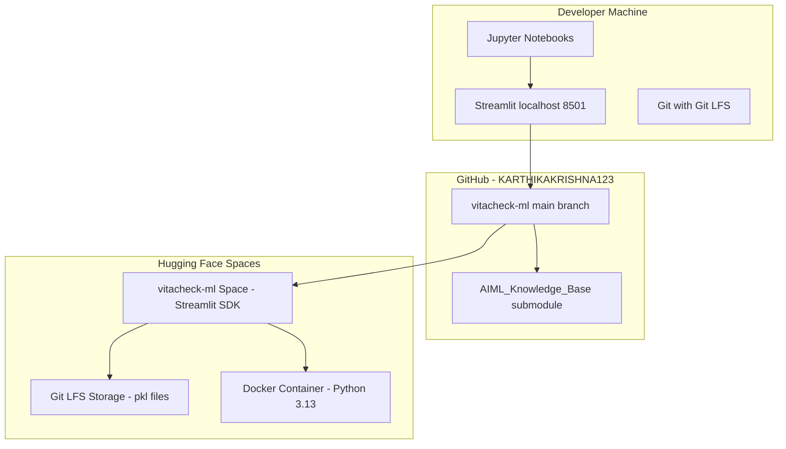

### 8. Package Diagram

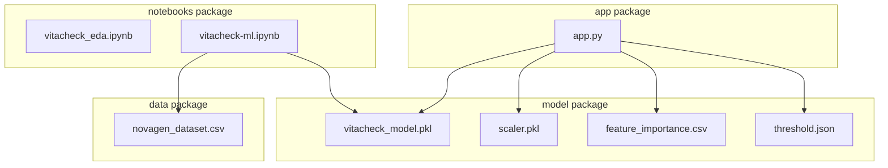

### 9. Object Diagram

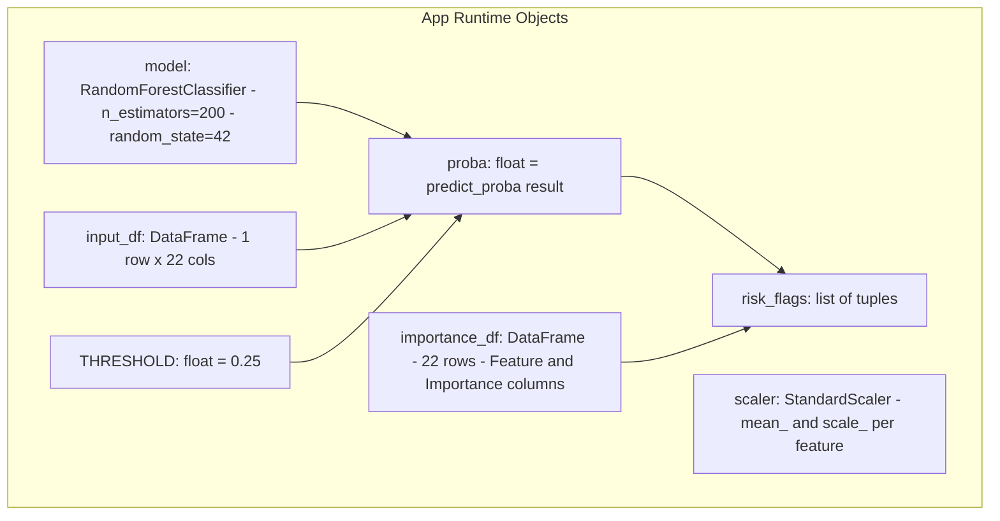

</details>

---

## Data Flow Diagrams

<details>
<summary>View DFD Level 0 and Level 1</summary>

### DFD Level 0 — Context Diagram

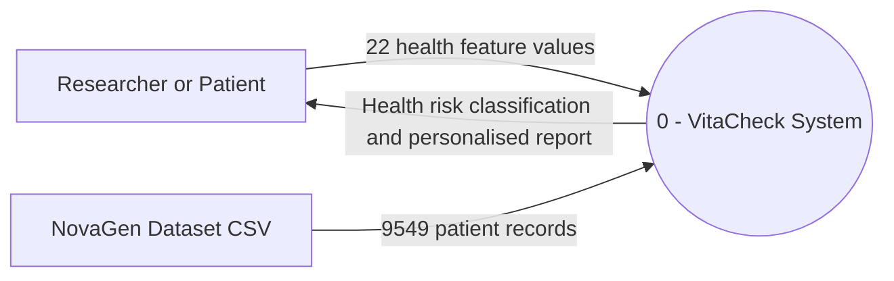

### DFD Level 1 — System Decomposition

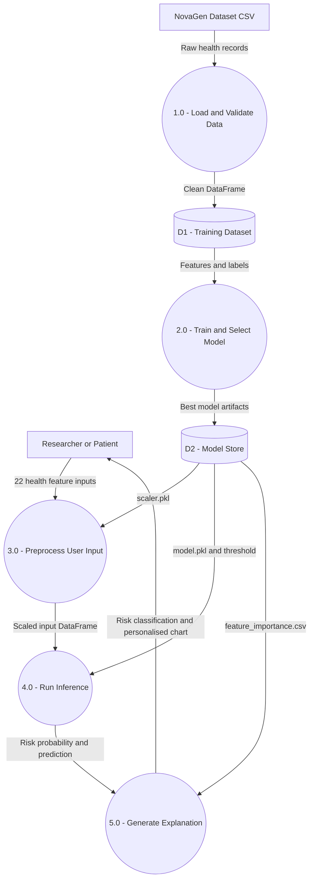

</details>

---

## Folder Structure

```
vitacheck-ml/
│
├── app.py                          ← Streamlit entry point — full dark UI
├── requirements.txt                ← HF Spaces dependency manifest
├── .gitattributes                  ← Git LFS tracking rules
│
├── model/                          ← Saved ML artifacts (Git LFS tracked)
│   ├── vitacheck_model.pkl         ← Trained RandomForestClassifier (200 trees)
│   ├── scaler.pkl                  ← Fitted StandardScaler
│   ├── feature_importance.csv      ← 22 features ranked by importance
│   └── threshold.json              ← Tuned threshold: 0.25
│
├── notebooks/
│   ├── vitacheck_eda.ipynb         ← EDA: null checks, heatmap, distributions
│   ├── vitacheck-ml.ipynb          ← Full ML pipeline: preprocessing to saving
│   ├── class_distribution.png
│   ├── correlation_heatmap.png
│   ├── feature_distributions.png
│   ├── boxplots_by_target.png
│   ├── feature_importances.png
│   ├── threshold_tuning.png
│   └── confusion_matrix.png
│
└── data/
    └── novagen_dataset.csv         ← Source dataset: 9549 records, 23 columns
```

---

## Installation

```bash
# Clone the repository
git clone https://github.com/KARTHIKAKRISHNA123/vitacheck-ml.git
cd vitacheck-ml

# Pull LFS files
git lfs pull

# Create virtual environment
python -m venv .venv
source .venv/Scripts/activate  # Windows Git Bash

# Install dependencies
pip install -r requirements.txt

# Run the app
streamlit run app.py
```

---

## Feature Reference

| Feature | Type | Description |
|---|---|---|
| Age | Continuous | Age in years |
| BMI | Continuous | Body Mass Index |
| Blood_Pressure | Continuous | Systolic blood pressure (mmHg) |
| Cholesterol | Continuous | Cholesterol level (mg/dL) |
| Glucose_Level | Continuous | Blood glucose (mg/dL) |
| Heart_Rate | Continuous | Resting heart rate (bpm) |
| Sleep_Hours | Continuous | Average sleep hours per day |
| Exercise_Hours | Continuous | Exercise hours per day |
| Water_Intake | Continuous | Daily water intake (litres) |
| Stress_Level | Ordinal | Self-reported stress (1-10) |
| Smoking | Ordinal | 0=Non-smoker, 1=Smoker, 2=Ex-smoker |
| Alcohol | Ordinal | 0=None, 1=Occasional, 2=Regular |
| Diet | Ordinal | 0=Standard, 1=Vegetarian, 2=Vegan |
| MentalHealth | Ordinal | 0=Good, 1=Moderate, 2=Poor |
| PhysicalActivity | Ordinal | 0=Sedentary to 3=Active |
| MedicalHistory | Ordinal | 0=None, 1=Minor, 2=Major |
| Allergies | Binary | Presence of known allergies |
| Diet_Type__Vegan | Binary | One-hot encoded from Diet |
| Diet_Type__Vegetarian | Binary | One-hot encoded from Diet |
| Blood_Group_AB | Binary | One-hot encoded blood type |
| Blood_Group_B | Binary | One-hot encoded blood type |
| Blood_Group_O | Binary | One-hot encoded blood type |

---

## Engineering Decisions

| Decision | Choice | Alternative | Rationale |
|---|---|---|---|
| Primary metric | Recall | Accuracy | Missing an at-risk person is medically more dangerous |
| Decision threshold | 0.25 | 0.50 default | Increases recall from 95.88% to 99.30% |
| Best model | Random Forest | Gradient Boosting | Higher recall, no scaling needed, faster inference |
| Feature scaling | LR and KNN only | Universal scaling | Tree-based models are scale-invariant |
| Table rendering | Pure HTML divs | pandas Styler | Streamlit dark theme makes Styler colors invisible |
| Model serialization | joblib | pickle | Better handling of large numpy arrays |
| Large file storage | Git LFS | Regular git | HF Spaces rejects files over 10MB in git history |
| Sidebar inputs | st.form | Individual widgets | Form suppresses reruns on every input — only one rerun on submit |
| Chart rendering | Base64 inline img with explicit dimensions | st.pyplot | Eliminates image-load layout shift; browser pre-allocates space before PNG decodes |
| Progress bar | CSS div with gradient | st.progress | st.progress re-renders its DOM on rerun causing flicker |
| Expandable section | HTML details/summary | st.expander | st.expander triggers full Python rerun on click; native HTML is browser-only |

---

## Fixing the HF Spaces Page Shake

<details>
<summary>Root cause analysis and resolution</summary>

### Why It Happens

HF Spaces embeds Streamlit apps inside an `<iframe>` with `height: auto`. The iframe listens to the Streamlit app via `postMessage` and resizes to match content height. Streamlit reruns the entire Python script on every widget interaction, which causes:

```
widget click → Python rerun → DOM cleared → DOM repainted → iframe resizes → visible jump
```

### What Was Tried and Why Each Failed

| Attempt | Why it failed |
|---|---|
| `@st.cache_data` on charts | Prevented recomputation but HTML elements still re-rendered |
| `st.empty()` slot | Slot still patches its content on every rerun |
| `st.session_state` snapshot | Identical HTML still caused DOM patches and flicker |
| Pre-computed `result_cache` | Python reruns still caused iframe resize |
| CSS `height: 100vh` lock | Applied too late; Streamlit's initial paint overrode it |
| Sliders to `number_input` | `+`/`-` buttons still triggered continuous reruns |
| `@st.fragment` on sidebar | `st.sidebar.*` not supported inside a fragment |
| `with st.sidebar:` inside fragment | Streamlit 1.45.1 blocks this — fragment and sidebar contexts conflict |

### The Actual Fix — Four Compounding Causes

**Cause 1 — Continuous reruns on every widget interaction**

Fixed with `st.form()`. All sidebar inputs wrapped in a single form. Widget interactions inside a form produce zero reruns. Only the submit button triggers one deliberate rerun.

**Cause 2 — `st.pyplot` image-load layout shift**

`st.pyplot` inserts an `` with no declared dimensions. The browser renders the page, reports height to HF Spaces, then the PNG loads, the image expands, and a second resize message fires. Fixed by encoding charts as inline base64 with explicit pixel dimensions:

```python
f''
```

**Cause 3 — DOM branch swap on state transition + iframe resize**

When landing page transitions to results page, all DOM nodes are replaced. Fixed with CSS:

```css
.block-container { min-height: 100vh !important; }
.stApp { height: 100vh !important; overflow: hidden !important; }
[data-testid="stMain"] { height: 100vh !important; overflow-y: auto !important; }
```

**Cause 4 — `st.expander` and `st.progress` rerenders**

`st.expander` click triggers a full Python rerun. `st.progress` re-renders its DOM on rerun. Fixed by replacing both with pure HTML equivalents — CSS gradient div for progress, native `<details>`/`<summary>` for expandable sections.

### Final State

The app triggers **exactly one** Python rerun per session — when the user clicks submit. Every other interaction is handled entirely in the browser. The iframe height is locked and never changes.

</details>

---

## Troubleshooting

| Error | Cause | Fix |
|---|---|---|
| FileNotFoundError: model/vitacheck_model.pkl | LFS not pulled or wrong directory | Run `git lfs pull` then `streamlit run app.py` from project root |
| FileNotFoundError in notebook | Notebook is in notebooks/ subdirectory | Use `../data/novagen_dataset.csv` |
| HF push rejected over 10MB | Model committed without LFS | Run `git lfs migrate import --include="*.pkl" --everything` |
| HF push rejected binary files | PNG files not in LFS | Run `git lfs migrate import --include="*.png" --everything` |
| KeyError RdY1Gn colormap | Typo — 1 instead of lowercase l | Change to `cmap="RdYlGn"` |
| Page shaking on HF Spaces | iframe auto-resize on every Streamlit rerun | Use `st.form` for all inputs; render charts as base64 with explicit dimensions; replace `st.expander` and `st.progress` with HTML equivalents |
| `st.fragment` sidebar error | `st.sidebar.*` not supported inside fragment | Use `st.form` instead — simpler and more effective for this use case |

---

## License

MIT License — see [LICENSE](LICENSE) for details.

---

## Credits

- Dataset: NovaGen Research Labs observational health study (9,549 records)
- Built as part of Anna University CSE supervised ML curriculum
- Developed by **Karthika Krishna M** — [GitHub](https://github.com/KARTHIKAKRISHNA123)

---

<div align="center">

**VitaCheck** · Random Forest + Streamlit · For research purposes only · Not a substitute for clinical diagnosis

</div>
